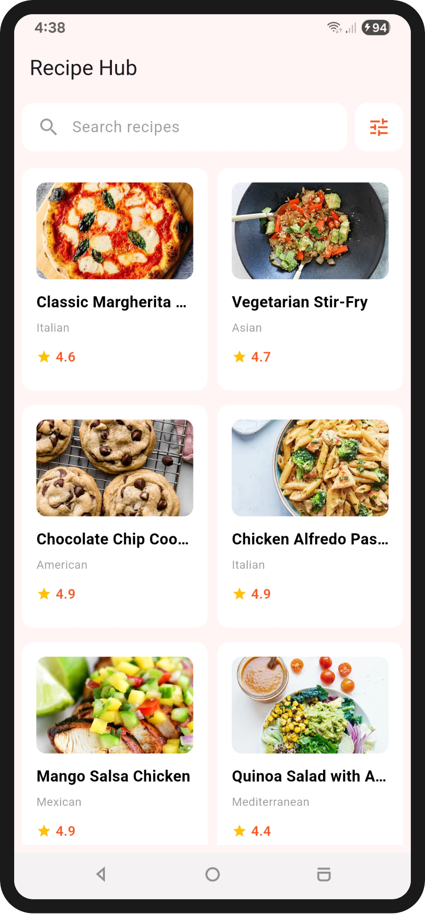
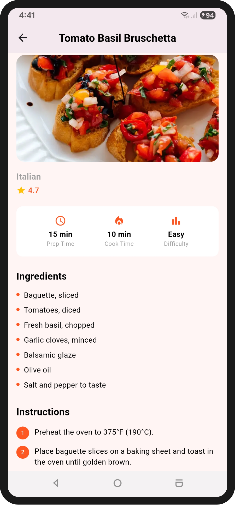
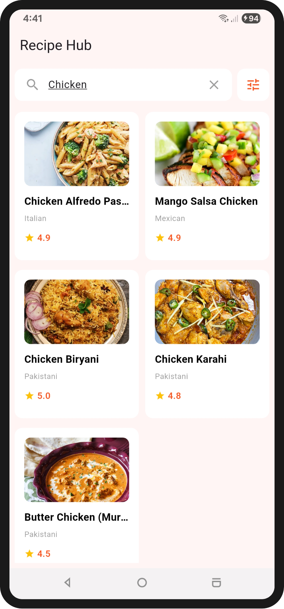
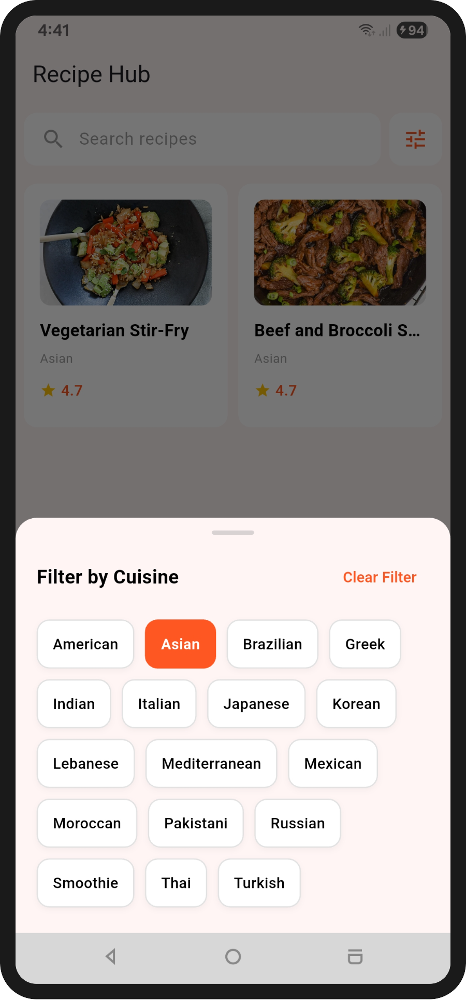

# Recipe Hub 

A Flutter application that fetches recipes from a public REST API and displays them in a clean, responsive grid, with a detailed recipe view.

## 📱 Features

- **Home Screen** — displays a responsive grid of recipes fetched from a live API
- **Search** — filter recipes by name in real time (client-side)
- **Cuisine Filter** — filter recipes by cuisine using selectable chips (client-side)
- **Details Screen** — shows full recipe information: ingredients, step-by-step instructions, prep/cook time, and difficulty
- **Responsive Design** — grid layout adapts column count and padding based on screen width (mobile vs tablet)
- **Reusable Widgets** — `CustomText`, `RecipeItem`, `RecipeStatBadge`, `CustomSearchBar`, `FilterChipItem` used across multiple screens
- **Feature-First Architecture** — code is organized by feature (`features/home/`), with data and presentation layers separated within each feature

## 🛠️ Tech Stack

| Package | Purpose |
|---|---|
| `flutter_bloc` | State management (Cubit) |
| `dio` | HTTP networking |
| `get_it` | Dependency injection / service locator |
| `cached_network_image` | Image loading and caching |

## 🌐 API

Data is fetched from [DummyJSON Recipes API](https://dummyjson.com/recipes).

## 📂 Project Structure

```
lib/
├── core/
│   ├── constants/
│   │   ├── app_colors.dart
│   │   ├── app_strings.dart
│   │   └── api_constant.dart
│   ├── di/
│   │   └── service_locator.dart
│   └── routing/
│       ├── app_router.dart
│       └── routes.dart
├── features/
│   └── home/
│       ├── data/
│       │   ├── model/
│       │   │   └── recipe_model.dart
│       │   └── repository/
│       │       └── recipe_repository.dart
│       └── presentation/
│           ├── cubit/
│           │   ├── recipe_cubit.dart
│           │   └── recipe_state.dart
│           ├── screens/
│           │   ├── home_screen.dart
│           │   └── details_screen.dart
│           └── widgets/
│               ├── custom_text.dart
│               ├── recipe_item.dart
│               ├── recipe_stat_badge.dart
│               ├── custom_search_bar.dart
│               ├── filter_chip_item.dart
│               └── filter_bottom_sheet.dart
└── main.dart
```

## 🏗️ Architecture

```
UI (Screens) → Cubit → Repository → Dio → API
```

- **Model** — maps raw JSON to `RecipeModel`
- **Repository** — abstracts the data source (API call)
- **Cubit** — manages UI state (loading / success / error)
- **Service Locator (get_it)** — builds and injects dependencies

> Note: this follows a Feature-First structure with data/presentation layer separation inside each feature, not the full Clean Architecture (no domain/use-case layer), which was unnecessary for the scope of this app.

## 🚀 Getting Started

```bash
# Clone the repository
git clone https://github.com/marwa-eltayeb/RecipeHub.git
cd RecipeHub

# Install dependencies
flutter pub get

# Run the app
flutter run
```

## 📸 Screenshots
| Home | Details |
|---|---|
|  |  |

| Search | Filter |
|---|---|
|  |  |

> Screenshots are located in the `/screenshots` folder at the root of the repository.

## 👤 Author
[@marwa-eltayeb](https://github.com/marwa-eltayeb)
